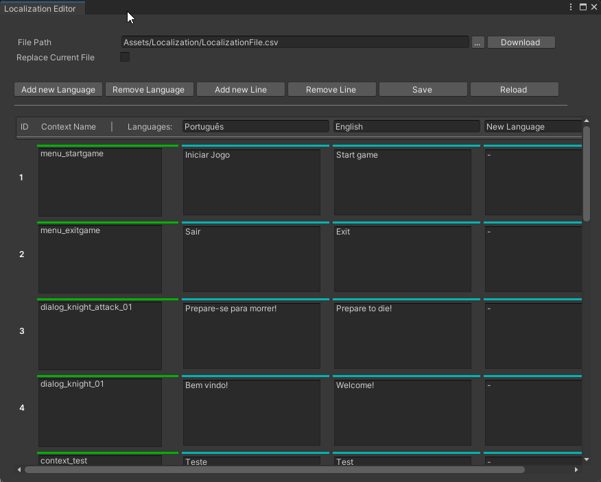

# Unity Localization System
Allow to localize Unity's texts and images to a selected language. For texts, it's made to be used with TextMeshPro, detecting text from a .cvs file by context.
Easy to use, can be extended to as many languages needed, just by editing the .cvs document.

## How To Use
Components availables:
- Localized Text - Add with a TextMeshPro component and select by context what text corresponds to this, so the text will be localizeed when enter Playmode;
- Localized Image - Add with an Image component and set the sprite that corresponds to the localization;

For Text, there is the Localization Editor, that creates, read and modify an .csv file that contains all the localization info as texts and languages.
The languages available in the Localized Image correspond to the ones in the .csv file.

